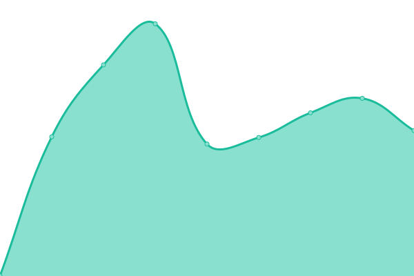

# [📈 Live Status](https://wufr.github.io/monitoring): <!--live status--> **🟩 All systems operational**

This repository contains the open-source uptime monitor and status page for [Jiří Bělský](https://wufr.github.io/monitoring), powered by [Upptime](https://github.com/upptime/upptime).

With [Upptime](https://upptime.js.org), you can get your own unlimited and free uptime monitor and status page, powered entirely by a GitHub repository. We use [Issues](https://github.com/wufr/monitoring/issues) as incident reports, [Actions](https://github.com/wufr/monitoring/actions) as uptime monitors, and [Pages](https://wufr.github.io/monitoring) for the status page.

<!--start: status pages-->
<!-- This summary is generated by Upptime (https://github.com/upptime/upptime) -->
<!-- Do not edit this manually, your changes will be overwritten -->
<!-- prettier-ignore -->
| URL | Status | History | Response Time | Uptime |
| --- | ------ | ------- | ------------- | ------ |
|  [Dark Side Movement](https://www.darksidemovement.cz) | 🟩 Up | [dark-side-movement.yml](https://github.com/wUFr/monitoring/commits/HEAD/history/dark-side-movement.yml) | 

 752ms
     
 | 

<a href="https://wufr.github.io/monitoring/history/dark-side-movement">100.00%</a>
    

|  [Dermacol MX](https://dermacol.mx) | 🟩 Up | [dermacol-mx.yml](https://github.com/wUFr/monitoring/commits/HEAD/history/dermacol-mx.yml) | 

 634ms
     
 | 

<a href="https://wufr.github.io/monitoring/history/dermacol-mx">99.96%</a>
    

|  [Komárek Dyzajn](https://komarekdyzajn.cz) | 🟩 Up | [komarek-dyzajn.yml](https://github.com/wUFr/monitoring/commits/HEAD/history/komarek-dyzajn.yml) | 

 964ms
     
 | 

<a href="https://wufr.github.io/monitoring/history/komarek-dyzajn">100.00%</a>
    

<!--end: status pages-->

[**Visit our status website →**](https://wufr.github.io/monitoring)

## 📄 License

- Powered by: [Upptime](https://github.com/upptime/upptime)
- Code: [MIT](./LICENSE) © [Jiří Bělský](https://wufr.github.io/monitoring)
- Data in the `./history` directory: [Open Database License](https://opendatacommons.org/licenses/odbl/1-0/)
